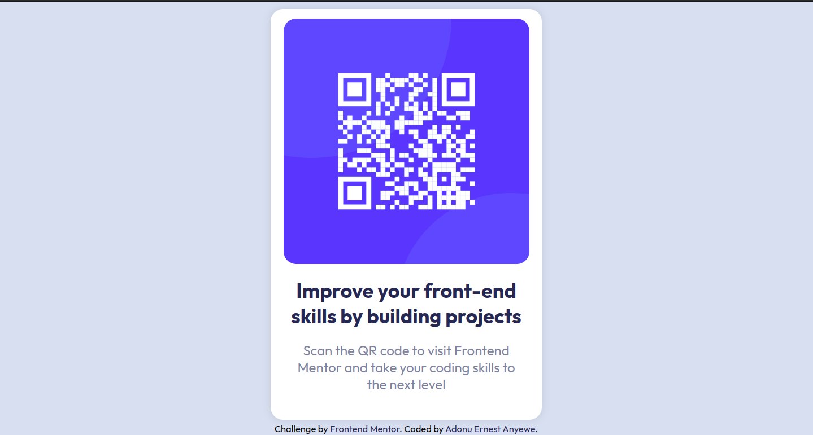

# Frontend Mentor - QR code component solution

## Table of contents

- [Overview](#overview)
  - [Screenshot](#screenshot)
  - [Links](#links)
- [My process](#my-process)
  - [Built with](#built-with)
  - [What I learned](#what-i-learned)
  - [Continued development](#continued-development)
- [Author](#author)
- [Acknowledgments](#acknowledgments)

## Overview

  This is a solution to the [QR code component challenge on Frontend Mentor](https://www.frontendmentor.io/challenges/qr-code-component-iux_sIO_H). Frontend Mentor challenges help programmers improve their coding skills by building realistic projects.

### Screenshot

<center>
  
</center>

<center>
  
</center>

### Links

- Solution URL: [Solution/GitHub Repo](https://github.com/principlebrothers/QR-CODE)
- Live Site URL: [QR-CODE Live](https://qr-code-component-main-psi-jet.vercel.app/)

## My process

### Built with

- Semantic HTML5 markup
- CSS custom properties
- Flexbox
- Mobile-first workflow

### What I learned

```html
<h1>Some HTML code I'm proud of</h1>
```

```css
:root {
  --white: hsl(0, 0%, 100%);
  --light-gray: hsl(212, 45%, 89%);
  --grayish-blue: hsl(220, 15%, 55%);
  --dark-blue: hsl(218, 44%, 22%);
  --font-family: 'Outfit', sans-serif;
}

body {
  font-family: var(--font-family);
  padding: 0.5rem;
  font-size: 15px;
  font-weight: 400;
  background-color: var(--light-gray);
  height: 100vh;
}
```

### Continued development

```
Areas that you want to focus on are

- Animations

- Layouts
```

## Author

- Website - [Ernest Anyewe Adonu](https://eaadonu-principlebrothers.vercel.app)
- Frontend Mentor - [@principlebrothers](https://www.frontendmentor.io/profile/principlebrothers)
- Twitter - [@adonu_ernest](https://twitter.com/adonu_ernest)

## Acknowledgments
